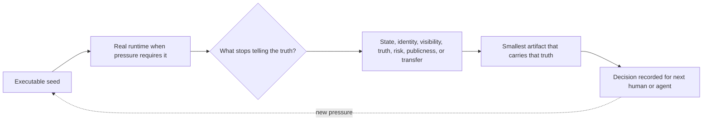

# AppBuildProcOS Presentation

## Slide 1: Title

**AppBuildProcOS**

How Brett moves from idea to functioning, deployed, operated, and evolving software.

## Slide 2: Research Question

What is Brett's actual application-building operating system?

Not the idealized process. Not a generic lifecycle. The real pattern visible across repositories, commits, ADRs, changelogs, migrations, dashboards, tests, public assets, and abandoned artifacts.

## Slide 3: Corpus

Ten projects:

- agent828
- repOptics
- AVLmc
- morethanone
- TarotTALKS
- fd_demo
- ids
- bmccall17.github.io / darketype
- Submission Cockpit
- KintsugiBlackjack

Excluded by plan: Ghost Job Detector, thirtysix, YESYESNO Bot, sidexside.

## Slide 4: Evidence Standard

Claims were based on:

- Git commits and commit dates
- ADRs, PRDs, changelogs, ship logs, runbooks
- Package manifests and deployment config
- Migrations and persistence files
- Admin/ops surfaces
- Tests, CI, Snyk/Sentry/observability evidence
- Social metadata and public assets
- File mtimes when Git was absent or misleading
- Satellite exports for offsite projects

Every conclusion is treated as Observed, Inferred, Recommended, or Gap.

## Slide 5: The First Big Finding

Brett does not build in a strict waterfall.

He builds in a reality-seeking loop:

1. Make the idea executable.
2. Expose it to a real environment.
3. Watch where truth breaks.
4. Build the missing instrument or source of truth.
5. Record the decision.
6. Package the learning for the next human or agent.

## Slide 6: Pattern 1: Fast Executable Seeds

Across the corpus, projects begin with a fast working loop:

- ids: scaffold -> constants -> boids -> simulation -> renderer -> input -> HUD -> audio in one committed sequence.
- AVLmc: initial Codex-built app, persistence, deployment, auth, Spotify, personalization within days.
- TarotTALKS: deployment, database, content loading, and design integration in the first two days.
- KintsugiBlackjack: scaffold and GDD immediately followed by ADRs for mobile, multiplayer, and engine structure.

The first priority is not perfect architecture. It is contact with the core loop.

## Slide 7: Pattern 2: Real Runtime Early

When a product needs publicness, live data, multiplayer, or external services, Brett pushes it into a real runtime early.

Evidence:

- agent828: Docker/Cloud Run and region fixes on day one.
- AVLmc: Vercel URL by day two.
- TarotTALKS: Vercel deployment setup on day one.
- fd_demo/KintsugiBlackjack: PartyKit appears early for multiplayer.
- darketype: GitHub Pages workflow in the second commit.

Runtime is used as a discovery tool.

## Slide 8: Pattern 3: Admin Appears When The System Becomes Opaque

Admin and operator tooling usually arrive after the core loop works but becomes hard to inspect.

Evidence:

- Submission Cockpit exists because scraper leads were invisible.
- AVLmc admin portal becomes a living operating system.
- agent828 adds operator runs, lead chips, pending counts, integrity ledgers.
- morethanone adds admin panel and admin test rounds after live session complexity.
- KintsugiBlackjack builds balance calculators and tuning dashboards.

The trigger is not "admin phase." The trigger is opacity.

## Slide 9: Pattern 4: Source Of Truth Is The Real Maturity Move

The strongest recurring maturity action is consolidating truth.

Evidence:

- Submission Cockpit retires `APPLICATION_QUEUE.md` because drift is structural.
- repOptics introduces evidence-aware scoring states and snapshot integrity.
- agent828 makes queues and context lake authority explicit.
- AVLmc consolidates DB schema and migrates Aiven -> Neon.
- fd_demo creates a rules audit after rule sources diverge.

The process becomes rigorous where facts must stay true.

## Slide 10: Pattern 5: Guardrails Follow Concrete Risk

Testing, security, monitoring, and validators often arrive after a named failure mode.

Evidence:

- Submission Cockpit tests follow duplicate-application risk.
- AVLmc account-loop tests follow auth/linking complexity.
- agent828 CU-hour gates follow Neon cost pressure.
- TarotTALKS Snyk/Sentry follow public maturity.
- morethanone Supabase policies follow operated release maturity.
- repOptics is the exception: tests and governance arrive unusually early because the product is itself about repository confidence.

## Slide 11: Pattern 6: Presentation Is Product Work

Presentation is not merely polish.

Evidence:

- TarotTALKS depends on imagery, metadata, social campaigns, and public story.
- AVLmc adds logo, icons, public header, OG/Twitter images early.
- darketype is a publishing system and reflection layer.
- KintsugiBlackjack's creative pivot is implemented through a visual/narrative theme layer.
- morethanone adds demo scenarios and public RCV explanations.

The trigger is: a human outside the build loop needs to understand or feel the thing.

## Slide 12: The Role Of Intuition

Brett's intuition is strongest at recognizing phase transitions before they are formally named:

- "This works, but I cannot see it."
- "This artifact is drifting."
- "This needs to be shareable now."
- "The public claim needs evidence."
- "The game works, but I need instruments to tune it."
- "The next agent will need context."

AppBuildProcOS makes those instincts explicit.

## Slide 13: Productive Chaos

Productive chaos:

- Fast deployment to reveal reality.
- Creative pivots that preserve optionality.
- Instrumentation before full content.
- Public reflection that feeds future process.

Examples:

- Kintsugi theme layer preserves Blackjack mode.
- Kintsugi and fd_demo build dashboards/audits before all content is final.
- darketype turns project lessons into public artifacts.

## Slide 14: Avoidable Chaos

Avoidable chaos:

- Multiple sources of truth.
- Missing guardrails after risk is known.
- Stock or stale README after product identity changes.
- Dirty working trees as hidden history.
- Naming drift after public identity stabilizes.

The goal is not to remove exploration. The goal is to reduce ambiguity where the system must tell the truth.

## Slide 15: The Operating System

Nine project states:

1. Spark to Executable Seed
2. Real Runtime
3. Durable State
4. Identity and Access
5. Operational Visibility
6. Truth Consolidation
7. Guardrails After Evidence
8. Public Object
9. Reflection and Transfer

Projects can occupy multiple states at once and revisit states as pressure changes.

Visual companion: `visual_model.md` shows the loop, state relationship map, and next-artifact decision tree.

## Slide 16: Lightweight Version

For a solo weekend project:

1. Write one paragraph of intent.
2. Build the smallest executable loop.
3. Document one run command.
4. Add public name/screenshot/metadata only if sharing.
5. Name source of truth if state appears twice.
6. Add one focused test if a bug would cause repeated manual work.
7. End with a dated note: works, fake, next.

No default auth. No default database. No default admin.

## Slide 17: Full Operated Version

For live products:

1. Define the core loop and runtime.
2. Deploy early.
3. Define persistence and source of truth.
4. Add identity when account continuity matters.
5. Build admin visibility around real operator questions.
6. Record irreversible decisions.
7. Add guardrails tied to concrete risk.
8. Add public presentation before sharing.
9. Maintain backlog/ship log.
10. Publish or record process lessons.

## Slide 18: How Agents Should Help

Agents should:

- Inspect current evidence first.
- Classify the active project state.
- Identify missing truth carriers.
- Recommend the smallest next artifact.
- Avoid premature infrastructure.
- Preserve generative exploration.
- Add rigor where truth is at risk.

## Slide 19: The Practical Shift

The model replaces generic advice with state-aware questions:

- Is the loop executable?
- Is the runtime real enough?
- What state must survive?
- Who owns the state?
- What can the operator not see?
- Where can facts drift?
- What failure is now expensive?
- Who needs to understand this publicly?
- What lesson should transfer?

## Slide 20: Final Line

Build fast where the idea is uncertain.

Become rigorous where the system must tell the truth.
