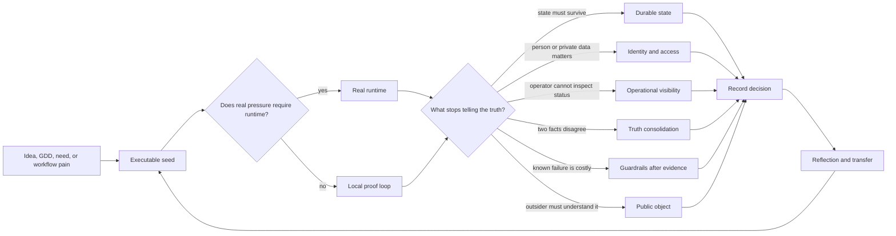
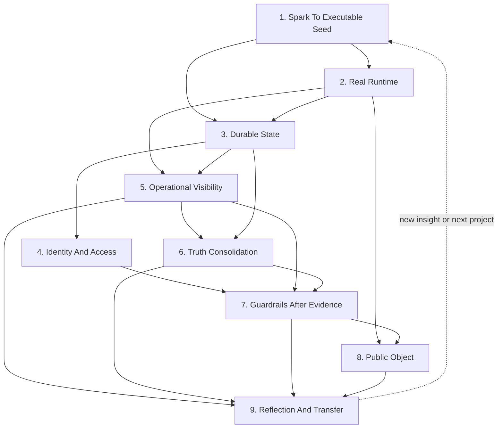
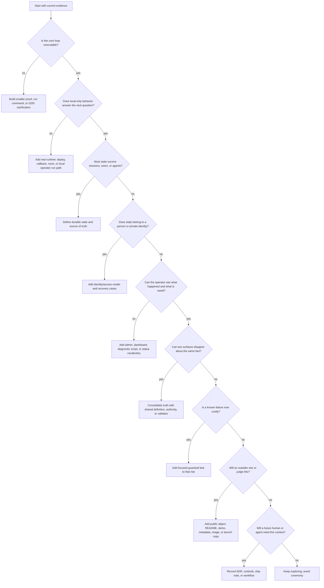

# AppBuildProcOS Visual Model

## Purpose

This file provides a teachable visual representation of AppBuildProcOS. It complements `brett_build_os.md`, `brett_build_os_agent.md`, and `application_checklist.md`.

The diagrams are intentionally loops and decision paths, not a waterfall. They show how Brett's process preserves exploration while adding structure when the project creates evidence that structure is needed.

## Core Reality-Seeking Loop

## State Relationship Map

## Decision Tree For The Next Artifact

## Pressure To Artifact Map

| Pressure | AppBuildProcOS State | Smallest Useful Artifact |
|---|---|---|
| The idea cannot be evaluated abstractly. | Spark To Executable Seed | Smaller runnable proof or first interaction. |
| Local behavior hides the real constraint. | Real Runtime | Deployment, callback, PartyKit room, or local operator runtime. |
| Facts can be lost or duplicated. | Durable State | Schema, migration, flat-file contract, or source-of-truth note. |
| Ownership or privacy matters. | Identity And Access | Auth model, account table, OAuth flow, or recovery path. |
| Status is invisible. | Operational Visibility | Admin view, dashboard, diagnostic script, or status vocabulary. |
| Two surfaces can disagree. | Truth Consolidation | Shared definition, authoritative source, retired mirror, or validator. |
| A known failure is now expensive. | Guardrails After Evidence | Focused test, CI/Snyk/Sentry check, cost guard, or incident runbook. |
| Someone outside the build loop must understand it. | Public Object | README, metadata, demo, favicon, OG image, or launch copy. |
| The lesson will be needed again. | Reflection And Transfer | ADR, runbook, ship log, agent workflow, or reflection artifact. |

## Teaching Summary

The simplest visual explanation is:

1. Build the smallest loop.
2. Expose it to the right reality.
3. Notice which kind of truth is now under pressure.
4. Add the smallest artifact that carries that truth.
5. Record enough context for the next human or agent.

This preserves the generative part of Brett's process: early work stays loose until the evidence shows which kind of structure is actually needed.
